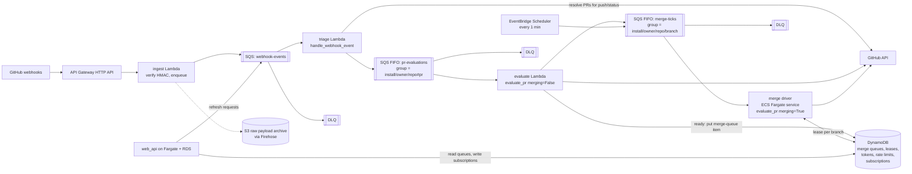

# Kodiak: design review and a cloud-native architecture

This document reviews how the Kodiak bot ingests and processes GitHub webhooks
today, lists the reliability problems in that design, and proposes a
cloud-native replacement built on managed AWS services, with the equivalent
Google Cloud services alongside. It ends with an incremental migration path
that does not require a rewrite.

## 1. How it works today

Two processes run in one container under supervisord (`bot/supervisord.conf`),
deployed to a single VM by Ansible and restarted every day at 04:00 UTC by a
systemd timer (`infrastructure/kodiak-daily-restart.timer`).

```mermaid
flowchart LR
    GH[GitHub webhooks] -->|POST /api/github/hook| Ingest
    subgraph container[one container, one VM]
        Ingest[ingest.py<br/>Starlette]
        Worker[worker.py<br/>single asyncio process]
    end
    Ingest -->|RPUSH kodiak:ingest:{install}<br/>PUBLISH kodiak:pubsub:ingest| Redis[(Redis)]
    Redis -->|BLPOP per installation| Worker
    Worker -->|ZADD webhook:{install}| Redis
    Redis -->|BZPOPMIN per installation| Worker
    Worker -->|ZADD merge_queue:{install}.{owner}/{repo}/{branch}| Redis
    Redis -->|BZPOPMIN per branch| Worker
    Worker -->|GraphQL / REST| GHAPI[GitHub API]
    WebAPI[web_api Django dashboard] -->|reads merge queues,<br/>writes subscriptions,<br/>pushes refresh requests| Redis
```

### Ingest (`bot/kodiak/entrypoints/ingest.py`)

1. Verifies the `X-Hub-Signature` HMAC-SHA1.
2. Drops administrative events and events with no installation id.
3. `RPUSH`es the raw payload onto `kodiak:ingest:{installation_id}`, `LTRIM`s
   the list to `INGEST_QUEUE_LENGTH` (1000), `SADD`s the queue name into
   `kodiak_ingest_queue_names`, and `PUBLISH`es on `kodiak:pubsub:ingest`.
4. Returns 200. GitHub does not retry failed deliveries on its own, so a 5xx
   here (for example Redis unavailable) loses the event.

### Worker (`bot/kodiak/entrypoints/worker.py`, `bot/kodiak/queue.py`)

One asyncio process owns every queue:

- **Ingest tasks.** On boot, one `work_ingest_queue` task per name in
  `kodiak_ingest_queue_names`, each blocking on `BLPOP`. A pubsub listener
  spawns tasks for installations seen for the first time. Each task runs
  `handle_webhook_event` with a 60 second timeout; the event is parsed and,
  for `push` and `status` events, GitHub is called to resolve which open PRs
  are affected. Each affected PR becomes a `WebhookEvent` `ZADD`ed with `NX`
  into the sorted set `webhook:{installation_id}` (so bursts for the same PR
  coalesce into one entry).
- **Webhook tasks.** One `webhook_event_consumer` per installation blocks on
  `BZPOPMIN` and runs `evaluate_pr(merging=False)`: fetch PR state from
  GitHub, compute mergeability, post the Kodiak check run, and when the PR is
  ready call `enqueue_for_repo`, which `ZADD`s it into
  `merge_queue:{install}.{owner}/{repo}/{branch}` and starts a repo task.
- **Repo (merge) tasks.** One `repo_queue_consumer` per branch key pops the
  head PR, writes a `...:target` marker so the dashboard and other
  evaluations can see what is merging, and runs `evaluate_pr(merging=True)`.
  That loop updates the branch, waits for required checks by re-querying
  GitHub every 3 seconds (`PollForever`, `POLL_RATE_SECONDS`), and merges.
- **Supervisor loop.** `main()` polls every 250 ms for finished tasks,
  reports the exception to Sentry, and recreates the task.

### Shared state in Redis

Redis is simultaneously the queue, the pubsub bus, the cache, and the shared
database between the bot and the dashboard:

| Key | Writer | Reader |
| --- | --- | --- |
| `kodiak:ingest:{install}` list | ingest | worker |
| `webhook:{install}` zset | worker, `refresh_pull_requests.py` | worker |
| `merge_queue:{install}.{owner}/{repo}/{branch}` zset + `:target` | worker | worker, `web_api/merge_queues.py` |
| `merge_queue_by_install:{install}` set (1 day TTL) | worker | web_api |
| `kodiak:subscription:{install}` hash | web_api | `queries.Client.get_subscription` |
| `kodiak:refresh_pull_requests_for_installation` list | web_api | `refresh_pull_requests.py` |
| `kodiak:webhook_event` list (zstd payloads) | worker | web_api `ingest_events` |

In-process state that is **not** shared: installation tokens
(`installation_cache`) and the per-installation rate limiter
(`throttle.THROTTLER_CACHE`, a hard-coded 5000 requests per hour).

## 2. What makes it unreliable

The invariants the design relies on are sound: serialize merges per base
branch, coalesce repeated events per PR, and re-derive everything from GitHub
so evaluation is idempotent. The problems are in how those invariants are
implemented.

1. **Every hop is at-most-once.** `BLPOP` and `BZPOPMIN` remove the item
   before it is processed. A crash, an OOM kill, a deploy, or the nightly
   restart mid-evaluation loses the event, and a PR mid-merge is popped off
   its merge queue and never put back. Nothing re-adds it until an unrelated
   webhook for that PR arrives, at which point it re-enters at the back of the
   queue. There is no ack, no visibility timeout, no dead-letter queue, and
   no retry counter.

2. **Backpressure drops the newest events.** `RPUSH` appends to the tail and
   `LTRIM 0 1000` keeps the head, so once an installation's ingest list holds
   1001 entries every new event is discarded (`ingest.py:93`). The usage
   reporting list has the same shape (`queue.py:238`). If the intent is a
   cap, it should keep the tail (`LTRIM -N -1`) or, better, not be a cap at
   all.

3. **Merge queues are not recovered after a restart.** `RedisWebhookQueue.create`
   restarts repo workers from `kodiak_merge_queue_names:v2`, but nothing ever
   writes to that set (only `merge_queue_by_install:*` is written, with a one
   day TTL). After every restart, PRs already sitting in a merge queue wait
   until some new event on that branch calls `enqueue_for_repo`.

4. **One process, one replica.** Per-key serialization is achieved by having
   exactly one asyncio task per queue in exactly one process. A second worker
   replica would pop from the same merge queues and merge concurrently, so
   the worker cannot be scaled out and is a single point of failure. CPU-bound
   work (parsing large payloads, zstd compression) stalls every installation.

5. **Unbounded task and connection growth.** Tasks and queue names are never
   retired, including for uninstalled apps. Each blocking pop holds a Redis
   connection, so connection count grows with the number of installations and
   branches ever seen. The daily restart is the symptom.

6. **Polling while merging is expensive.** A PR waiting on CI costs one
   GraphQL request every 3 seconds, about 1200 per hour per merging PR,
   against a 5000 per hour installation budget that the rate limiter assumes
   rather than reads.

7. **No durable record of what GitHub sent.** Raw payloads live only in Redis
   for as long as the list keeps them, so there is no replay after a bug and
   no audit trail.

8. **Tight coupling through Redis key formats.** The dashboard parses queue
   names and entry JSON (`web_api/merge_queues.py` says "must match schema
   from bot"). Any queue change has to carry the dashboard with it.

9. **Operational gaps.** No queue depth or age metrics, no alarms, task
   failure detection by 250 ms polling, secrets in `.env` files on the VM.

## 3. Target architecture

The workload separates into three stages with different shapes, and the
proposal gives each its own managed service:

| Stage | Shape | Requirement |
| --- | --- | --- |
| Receive webhook | stateless, bursty, must be fast | durable, at-least-once, replayable |
| Evaluate PR | short (seconds), idempotent | ordered and coalesced per PR, retried, dead-lettered |
| Merge | long-lived (minutes to hours), stateful | exactly one active merge per base branch, survives restarts |



### 3.1 Ingress: API Gateway + Lambda

- API Gateway HTTP API routes `POST /api/github/hook` to a small Lambda that
  verifies `X-Hub-Signature-256` (GitHub has sent the SHA-256 header for
  years; the code still checks the SHA-1 one) and `SendMessage`s the raw
  payload to the `webhook-events` SQS queue. It does nothing else, so it
  returns 200 in tens of milliseconds and there is no Redis on the request
  path.
- The same Lambda tees the payload to Kinesis Data Firehose, which batches
  into S3. That gives replay after a bug ("re-drive everything for
  installation X between 09:00 and 10:00"), an audit trail, and a source for
  the usage-reporting analytics that today go through Redis. Athena can query
  it directly.
- EventBridge also offers a managed GitHub inbound webhook that validates the
  signature for you. It is a reasonable alternative, but the Lambda is a few
  dozen lines and keeps the payload format under your control.

### 3.2 Triage: SQS standard queue + Lambda

- Lambda with an SQS event source on `webhook-events` runs today's
  `handle_webhook_event`: parse the event, call GitHub for `push` and
  `status` events to find affected PRs, and emit one `EvaluatePR` message per
  PR.
- Batch size 1 to 10, visibility timeout 2 minutes, `maxReceiveCount` 5, then
  a dead-letter queue. A failure is retried automatically, and a poison
  payload ends up somewhere visible instead of in a log line.
- Dashboard "refresh installation" requests (`refresh_pull_requests.py`)
  become a synthetic message on the same queue, deleting that sidecar
  process.

### 3.3 Evaluation: SQS FIFO + Lambda

- `pr-evaluations` is a FIFO queue. `MessageGroupId` is
  `{install}/{owner}/{repo}#{number}`. SQS delivers one in-flight message per
  group at a time, in order, which is exactly what one asyncio task per
  installation was approximating, but now across any number of consumers and
  with finer granularity (per PR instead of per installation).
- `MessageDeduplicationId` is the group id plus a coarse time bucket (for
  example 15 seconds). A burst of six events for one PR collapses to one
  evaluation, matching today's `ZADD NX` coalescing.
- The consumer runs `evaluate_pr(merging=False)` unchanged. It is already
  idempotent because it re-reads GitHub. Lambda concurrency scales with
  queue depth; if you would rather keep a long-lived Python process, an ECS
  Fargate service polling the same queue works identically.
- When a PR is ready to merge, the consumer writes a merge-queue item (3.5)
  and sends a `MergeTick` message.

### 3.4 Merge driver: long-running worker with a lease

The merge loop cannot be a short function as written: it waits on CI. The
lowest-risk design keeps the loop and moves the mutual exclusion out of the
process.

- `merge-ticks` is a FIFO queue with `MessageGroupId` =
  `{install}/{owner}/{repo}/{branch}`, consumed by an ECS Fargate service
  (2 or more tasks across availability zones).
- On a tick, the worker acquires a **lease** on the branch key in DynamoDB
  with a conditional write (`attribute_not_exists(lease_owner) OR
  lease_expires < now`), heartbeats it every 30 seconds, and runs
  `evaluate_pr(merging=True)` for the head item of that branch's merge queue.
  When the PR merges or is dequeued, it releases the lease and, if the queue
  is not empty, sends itself another tick.
- If the task dies, the lease expires and either the next tick or the
  **sweeper** (EventBridge Scheduler firing once a minute, enqueueing a tick
  for every branch with a non-empty queue and no live lease) resumes the
  merge. The item is still in the table, in its original position, so nothing
  is lost and nothing loses its place.
- Follow-up (optional): replace the 3-second polling with a Step Functions
  Standard workflow using the callback (task token) pattern. The execution
  stores its token on the merge-queue item and pauses; the triage Lambda
  calls `SendTaskSuccess` when a `check_run`, `status`, or `pull_request`
  event arrives for that PR; a 10 minute `Wait` state is the safety net.
  Waiting costs nothing and the GitHub API budget stops draining. This is
  worth doing second, after the lease design is in production.

### 3.5 State: one DynamoDB table

| Item | Key | Notes |
| --- | --- | --- |
| Merge queue entry | `PK=MQ#{install}#{owner}/{repo}/{branch}`, `SK={enqueued_at_ms}#{pr}` | Conditional put preserves position (today's `NX`); `first=True` uses `SK=0#{pr}`. Query gives ordered position for the check-run message and the dashboard. |
| Branch lease | `PK=MQ#...`, `SK=LEASE` | `lease_owner`, `lease_expires`, `merging_pr` (replaces the `:target` marker). |
| Installation | `PK=INSTALL#{install}`, `SK=META` | Cached installation token with TTL, `x-ratelimit-remaining` and reset time from the last response (replaces the hard-coded throttler), subscription state written by web_api. |

Firestore or ElastiCache could hold this instead, but DynamoDB conditional
writes and TTL are a direct fit, it is serverless, and it is readable from
both the bot and the dashboard without sharing a Redis URL. The dashboard's
`get_active_merge_queues` becomes a single `Query` per installation instead
of parsing queue names.

### 3.6 Everything around it

- **Secrets:** GitHub private key and webhook secret in Secrets Manager,
  injected as environment variables into Lambda and Fargate.
- **Schedules:** EventBridge Scheduler replaces the systemd timers for the
  merge sweeper and the web_api aggregation commands (run as Fargate tasks).
- **Dashboard:** `web_api` (Django) moves unchanged to Fargate behind the
  same API Gateway or an ALB, with RDS Postgres.
- **Observability:** CloudWatch alarms on `ApproximateAgeOfOldestMessage`
  for each queue, DLQ depth, Lambda error rate, and lease age; X-Ray traces
  from API Gateway through to the GitHub calls; structured logs already exist.
- **Infrastructure as code:** CDK or Terraform. Two stacks (staging, prod)
  from one definition replaces the Ansible inventory.

### 3.7 Google Cloud equivalents

| Role | AWS | Google Cloud |
| --- | --- | --- |
| Webhook ingress | API Gateway HTTP API + Lambda | Cloud Run service (or Cloud Functions 2nd gen) |
| Raw payload archive | S3 via Kinesis Data Firehose | Cloud Storage via a Pub/Sub Cloud Storage subscription |
| Triage queue | SQS standard + DLQ | Pub/Sub topic and subscription + dead-letter topic |
| Ordered per-PR / per-branch queue | SQS FIFO with `MessageGroupId` | Pub/Sub with ordering keys (next message for a key is held until the previous one is acked) |
| Coalescing | FIFO `MessageDeduplicationId` | Not built in; use a `dirty` flag on the Firestore PR document and skip stale messages |
| Evaluation compute | Lambda | Cloud Run (push subscription) |
| Merge driver | ECS Fargate service | Cloud Run worker pool or GKE Autopilot (Cloud Run request-driven services cap at 60 minutes, too short for CI waits) |
| State, leases, tokens | DynamoDB conditional writes + TTL | Firestore transactions + TTL policies |
| Long-wait orchestration | Step Functions callback pattern | Cloud Workflows callbacks |
| Secrets | Secrets Manager | Secret Manager |
| Cron | EventBridge Scheduler | Cloud Scheduler |
| Dashboard | Fargate + RDS Postgres | Cloud Run + Cloud SQL |
| Observability | CloudWatch + X-Ray | Cloud Monitoring + Cloud Trace |

Both work. AWS is the slightly better fit because SQS FIFO message groups
plus dedup ids and DynamoDB conditional writes map one-to-one onto the two
invariants Kodiak needs (per-key ordering with coalescing, and per-branch
exclusivity), and Step Functions' callback pattern is the more mature option
for the merge loop. On Google Cloud the coalescing and the long-running merge
worker each need a little more custom code.

## 4. What changes in the code

Most of the bot survives intact. `evaluate_pr`, `evaluation.mergeable`,
`queries.Client`, and the event schemas are untouched. The changes are
confined to the queue layer:

- `entrypoints/ingest.py`: replace the four Redis calls with one SQS send
  (and the Firehose put). Check `X-Hub-Signature-256`.
- `queue.py`: `WebhookQueueProtocol.enqueue` sends to `pr-evaluations`;
  `enqueue_for_repo` writes the DynamoDB item and sends a `MergeTick`.
  `RedisWebhookQueue`, `process_webhook_event`, `process_repo_queue`, and the
  consumer loops become a Lambda handler and a Fargate worker with the lease.
- `throttle.py` and `installation_cache`: read and write the installation
  item instead of process memory, and use the real `x-ratelimit-*` headers
  the code already logs.
- `queries.Client.get_subscription` and `web_api/merge_queues.py`: read the
  DynamoDB items.
- `refresh_pull_requests.py`: delete; web_api publishes to the triage queue.
- `worker.py` supervisor loop, `supervisord.conf`, the daily restart timer:
  delete.

## 5. Incremental path

Each step is independently shippable and improves reliability on its own.

1. **Fix the two bugs now, in Redis.** Make `LTRIM` keep the newest entries
   (or drop the cap), and `SADD` merge queue names into
   `kodiak_merge_queue_names:v2` in `enqueue_for_repo` so merges resume after
   a restart. One small PR.
2. **Split the container.** Run ingest and worker as separate deployables.
   Ingest becomes stateless and can run with several replicas immediately.
3. **Move ingress to the cloud first.** API Gateway + Lambda + SQS + S3
   archive, with a small bridge Lambda that pushes SQS messages into the
   existing Redis ingest lists. Webhook receipt is now durable and replayable
   while the worker is unchanged.
4. **Introduce the lease.** Put the per-branch lease and merge-queue items in
   DynamoDB and have the existing worker acquire the lease before merging.
   Now two worker replicas are safe, and a restart no longer strands merges.
   Update the dashboard read path at the same time.
5. **Move evaluation to SQS FIFO + Lambda.** Retire `webhook:{install}` and
   the Redis ingest lists. Redis is now only a cache, or gone.
6. **Move the merge driver to Fargate**, then optionally to Step Functions
   with the callback pattern to eliminate polling.

After step 4 the nightly restart can be removed. After step 5 the worker has
no per-installation tasks, no unbounded growth, and no single replica.
